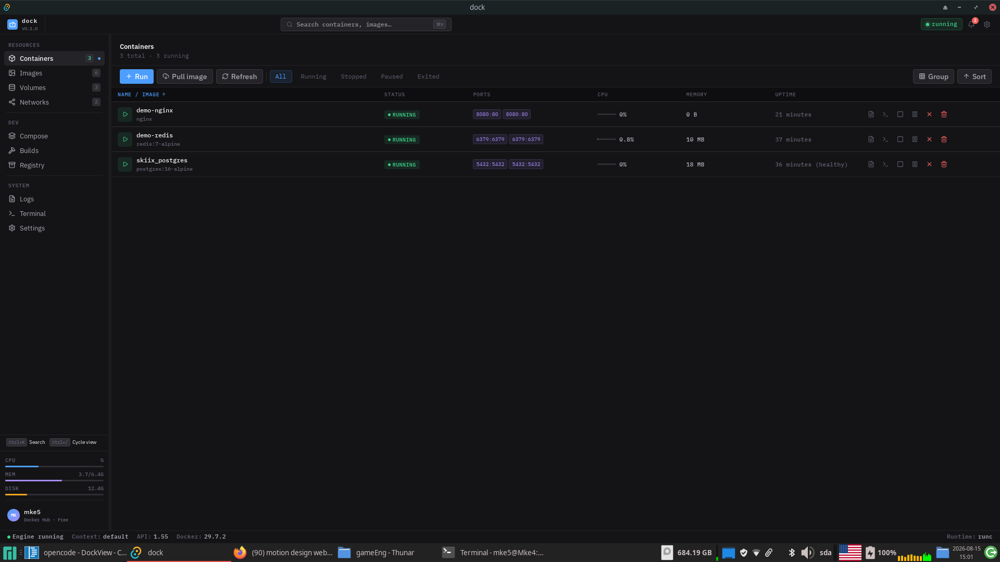
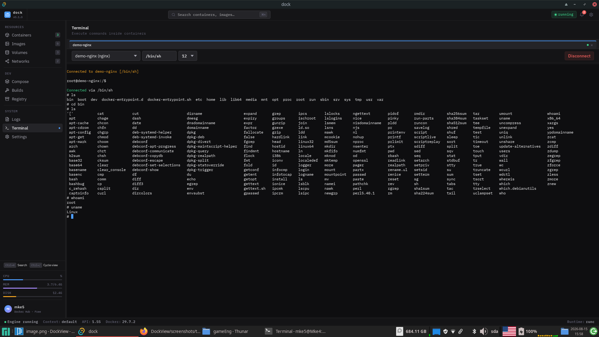
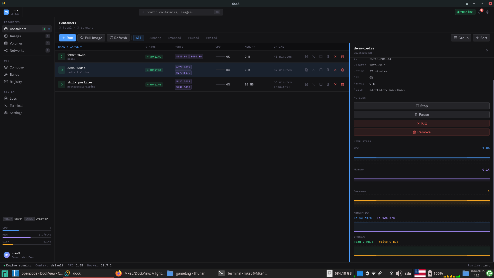

# DockView

> A local-first Docker desktop GUI built with [Tauri 2](https://v2.tauri.app/) and React — no Docker Desktop required.

[](https://github.com/Mke5/DockView/actions/workflows/ci.yml)
[](https://github.com/Mke5/DockView/actions/workflows/release.yml)
[](https://github.com/Mke5/DockView/actions/workflows/nightly.yml)
[](https://github.com/Mke5/DockView/actions/workflows/security.yml)
[](LICENSE)

---

## Table of Contents

- [Screenshots](#screenshots)
- [Features](#features)
- [Getting Started](#getting-started)
- [Usage](#usage)
- [How It Works](#how-it-works)
- [Tech Stack](#tech-stack)
- [Project Structure](#project-structure)
- [Development](#development)
- [CI/CD](#cicd)
- [Contributing](#contributing)
- [License](#license)

---

## Screenshots

| Containers View                                | Terminal Session                              | Stats Charts                           |
| ---------------------------------------------- | --------------------------------------------- | -------------------------------------- |
|  |  |  |


## Features

- **Container lifecycle** — start, stop, restart, pause, kill, remove, rename, inspect, and run ad-hoc containers with port/volume/env configuration
- **Image management** — pull, tag, push, prune, build from a Dockerfile, and inspect images
- **Volumes & Networks** — create, remove, prune, connect and disconnect containers
- **Compose stacks** — up/down `docker-compose.yml` projects
- **Registry login** — store private-registry credentials in the OS keychain (never in plaintext)
- **Exec terminal** — interactive TTY shell sessions inside running containers via xterm.js, with live input, window-resize sync, and session history replay
- **Live logs** — per-container log streaming with follow mode, stdout/stderr filters, and search
- **Live stats** — per-container CPU/memory streaming with 2-second batch emission and historical charts
- **Real-time events** — subscribe to Docker daemon events and auto-refresh affected views
- **System tray** — minimize to tray, show/hide, quit with `Ctrl+Q`
- **Keyboard shortcuts** — `Ctrl+K` to focus search, `Ctrl+/` to cycle the active view
- **Multi-context** — reads `~/.docker/config.json` to surface the active Docker context and available endpoints

## Getting Started

### Prerequisites

- [Node.js](https://nodejs.org/) >= 18 (CI uses 20)
- [Rust](https://rustup.rs/) (stable toolchain, per `rust-toolchain.toml`)
- [Tauri v2 system dependencies](https://v2.tauri.app/start/prerequisites/)
- A running Docker daemon

### Installation

```bash
git clone https://github.com/Mke5/DockView.git
cd DockView
npm install
```

### Run in development

```bash
npm run tauri dev
```

### Build a production bundle

```bash
npm run tauri build
```

Bundled installers are written to `src-tauri/target/release/bundle/`:
`.msi`/`.exe` (Windows), `.dmg` (macOS), `.deb`/`.AppImage` (Linux).

### Platform notes

- **Linux** — requires `webkit2gtk-4.1`, `libayatana-appindicator3`, `librsvg2`, and `patchelf` (see the Tauri prerequisites for your distribution)
- **macOS** — Xcode Command Line Tools are required
- **Windows** — Microsoft Visual C++ build tools and WebView2 are required

## Usage

Docker operations only run inside the Tauri window. In a plain browser (`npm run dev`) the app runs against mock data, since the Docker socket is not exposed to the webview outside Tauri.

- Click the **terminal** icon on a running container to open an interactive shell
- Click the **logs** icon to stream that container's output in the Logs view
- Use `Ctrl+/` to cycle views and `Ctrl+K` to focus search

## How It Works

The backend is a Tauri v2 Rust application that talks to the Docker daemon over its Unix socket (or Windows named pipe) through the [Bollard](https://github.com/fussybeaver/bollard) library. Streaming endpoints — container logs, image pulls, stats, exec output — push data to the frontend with Tauri events in real time.

The frontend is a React SPA built with Vite, with state managed by Zustand. Views respond to Docker events for live updates, and the terminal uses xterm.js with a fit addon and persists session history to `localStorage`. Registry credentials are stored in the OS keychain via the `keyring` crate.

### Tech stack

| Layer         | Technology                 |
| ------------- | -------------------------- |
| Desktop shell | Tauri 2 (Rust)             |
| Docker client | Bollard 0.18               |
| Frontend      | React 19, Vite, TypeScript |
| State         | Zustand                    |
| Charts        | Recharts                   |
| Terminal      | xterm.js                   |
| Credentials   | `keyring` crate            |

## Project Structure

```
dockview/
├── src/                    # React frontend
│   ├── backend/            # Typed Tauri IPC wrappers, bridge, helpers
│   ├── components/         # Views, modals, shared UI, layout
│   ├── hooks/              # Custom React hooks
│   ├── store/              # Zustand state stores
│   └── styles/             # Global CSS
├── src-tauri/              # Rust backend
│   ├── src/
│   │   ├── api/            # Tauri command handlers
│   │   ├── docker/         # Docker client, models, operations
│   │   ├── services/       # Background tasks (stats, events)
│   │   └── state/          # App state
│   └── tests/              # Rust unit & integration tests
├── .github/workflows/      # CI/CD pipelines
└── package.json
```

## Development

```bash
npm run dev          # Vite dev server (browser-only, mock data)
npm run lint         # ESLint
npm run type-check   # TypeScript
npm test             # Frontend unit tests
(cd src-tauri && cargo test)   # Rust unit tests
```

### Docker integration tests

The suite includes integration tests that require a live Docker daemon. Run them with:

```bash
(cd src-tauri && cargo test --test docker_integration -- --ignored)
```

## CI/CD

GitHub Actions pipelines in `.github/workflows/`:

| Workflow                                         | Triggers                                              | What it does                                                                                                                             |
| ------------------------------------------------ | ----------------------------------------------------- | ---------------------------------------------------------------------------------------------------------------------------------------- |
| [`ci.yml`](.github/workflows/ci.yml)             | Push/PR to `main` or `develop`                        | Lint, type-check, format, frontend tests, `cargo fmt`/`clippy`/`test`, then a 4-platform build matrix with artifact upload               |
| [`release.yml`](.github/workflows/release.yml)   | `v*` semver tags (`v1.2.3`, `-rc`, `-beta`, `-alpha`) | Release builds for all platforms, Windows code signing, macOS notarization, generated release notes, GitHub Release creation             |
| [`nightly.yml`](.github/workflows/nightly.yml)   | Daily at 00:00 UTC                                    | Latest main builds tagged `nightly` with date/sha versioning, artifact cleanup, notifications                                            |
| [`security.yml`](.github/workflows/security.yml) | Push/PR + weekly                                      | Secret scanning (TruffleHog/Gitleaks), `npm audit`, `cargo audit`, CodeQL + Semgrep SAST, dependency license compliance, SBOM generation |

Release builds require the following repository secrets:

| Secret                                                       | Purpose                          |
| ------------------------------------------------------------ | -------------------------------- |
| `TAURI_PRIVATE_KEY`, `TAURI_KEY_PASSWORD`                    | Signing of auto-update bundles   |
| `WINDOWS_CERTIFICATE_BASE64`, `WINDOWS_CERTIFICATE_PASSWORD` | Windows code signing             |
| `APPLE_ID`, `APPLE_APP_PASSWORD`, `APPLE_TEAM_ID`            | macOS notarization               |
| `DISCORD_WEBHOOK`, `SLACK_WEBHOOK`                           | Release notifications (optional) |

## Contributing

Contributions are welcome!

1. Fork the repository
2. Create a feature branch: `git checkout -b feat/my-feature`
3. Commit your changes and open a pull request against `main`
4. Make sure `npm run lint`, `npm run type-check`, and `cargo fmt`/`clippy` pass

See `.github/workflows/ci.yml` for the exact checks that must pass.

## License

[MIT](LICENSE) © 2026 Mke5
